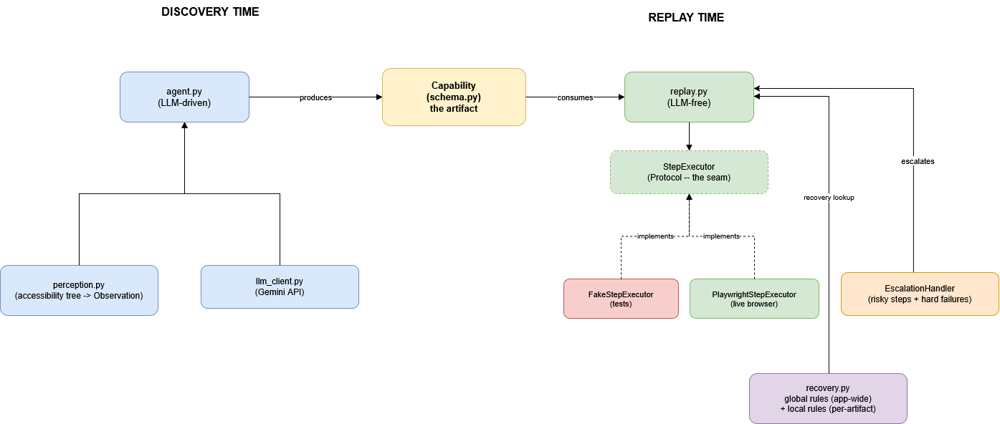

# Computer-Use Automation System — Design Report

An LLM agent explores a real web UI once to accomplish a goal, and that
successful run is recorded as a reusable, versioned **capability
artifact**. Future requests for the same task are served by **replaying
the artifact directly** — with zero LLM calls — using typed error
handling, redacted secrets, risk-gated human escalation for irreversible
actions, and a feedback loop where human-resolved edge cases can update
the artifact itself.

Target application: [SauceDemo](https://www.saucedemo.com/), an
automation-friendly demo e-commerce site.

**The core claim is demonstrated live, not just designed on paper.** A
discovery run (goal: log in, add the Sauce Labs Backpack to cart, view
the cart) took ~6 LLM calls and produced a 5-step `Capability`. Replaying
that exact artifact afterward completed all 5 steps successfully with
**zero LLM calls**. See `/evidence/` for the saved artifact and logs from
both runs.

## Architecture

**The seam**: `StepExecutor` (in `replay.py`) is a `Protocol` defining
*what* an executor must do (`execute`, `observe_current_state`), not
*how*. `replay.py`'s entire control-flow logic — risk gating, outcome
classification, recovery lookup, placeholder substitution — was built
and fully unit-tested against a `FakeStepExecutor` that never touches a
browser. When `PlaywrightStepExecutor` was written later and swapped in
for a live run, **zero lines of `replay.py` changed**. This is confirmed
by running both, not just asserted.

**Key trade-offs made deliberately:**
- **Text-only perception** (accessibility tree via `aria_snapshot()`),
  not screenshots — simpler and cheaper, reasonable for SauceDemo's
  well-structured markup; a real limitation for messier legacy UIs (see
  Heterogeneity, below).
- **Plain-prompt JSON** for the LLM's decisions, not a provider-specific
  structured-output mode — more transparent to reason about and debug,
  at the cost of needing defensive parsing (`llm_client.py` handles
  markdown-fenced and malformed responses explicitly).
- **Indexed element selection** (the LLM picks a numbered element from an
  observed list, not free-text description) — removes the fragile
  "does the LLM's description match a real element" problem entirely.

## Artifact schema

A `Capability` (`schema.py`) is the recorded, reusable unit:

- **`steps: list[Step]`** — an ordered, flat list. No branching inside
  the artifact itself; branching/recovery logic lives in the replay
  engine, not the data format.
- **`ElementTarget` / `Locator`** — each step's target carries an
  *ordered list* of locator strategies (accessibility role+name, with
  room for CSS/text-content fallback), each with a `confidence` score and
  optional `reasoning` explaining *why* (e.g. "no accessible name
  present"). This is inspectable by a human reviewer, not just a number.
- **`input_params` / `output_fields`** — the capability's typed contract.
  `input_params` is populated automatically when discovery detects a
  sensitive field (see Safety, below) and also serves as the general
  mechanism for any value that should be supplied fresh per invocation
  rather than baked into the artifact.
- **`expected_business_outcomes`** — pre-registered, named signatures
  (e.g. "text contains 'No member found' → NOT_FOUND") so replay never
  has to guess or re-invoke an LLM to recognize a known non-error result.
- **`local_recovery_rules`** vs. **global rules** (`recovery.py`) — a
  deliberate split: conditions that are properties of the target
  application itself (a session-timeout dialog) live in one shared,
  engine-level list, checked automatically for every capability.
  Conditions specific to one task stay scoped to that task's artifact.
  Rejected alternative: declaring every recovery condition per-artifact,
  since a single app-wide fix would then need duplicating across every
  capability that could encounter it.
- **`RiskLevel` (static) + `dynamic_risk_check` (optional, schema-only)**
  — risk is two-layered by design: a static classification assigned once
  at recording time (does this action's *nature* make it irreversible),
  plus an optional per-invocation check against real parameter values
  (e.g. "amount > 1000"). Static risk is implemented and enforced;
  dynamic checks are defined in the schema but not yet evaluated — see
  Cuts.
- **`revision_history` / `version`** — supports a human-resolution
  feedback loop: when a human resolves a previously-unrecognized state,
  the artifact can gain a new signature as a **new version**, never an
  in-place overwrite, so the change stays auditable and reversible.

## Determinism & error handling

Every step's result is classified into exactly one of four categories
(`replay.py::_classify_outcome`):

| Category | Meaning | Escalates? | Continues replay? |
|---|---|---|---|
| `SUCCESS` | Expected outcome | No | Yes |
| `BUSINESS_OUTCOME` | Known, named non-error result | No | No — returned as a final result, not a failure |
| `RECOVERABLE` | Matched a global or local recovery rule | No | Yes, automatically |
| `HARD_FAILURE` | Matched nothing | **Yes** | Only if a human resolves it |

Business outcomes are checked before recovery rules (a pre-registered
signature is more specific than a generic trigger). **An unrecognized
state never defaults to a guessed success** — it defaults to
`HARD_FAILURE` and escalates.

**Determinism mechanics:**
- Locators are tried in a fixed, stored order (accessibility role+name
  first); no re-reasoning about the UI at replay time.
- Redacted values (`{{password}}`-style placeholders — see Safety) are
  resolved from a caller-supplied `input_values` dict immediately before
  execution, via `_resolve_step_value()`; a missing value raises
  `MissingInputValueError` rather than substituting a blank.
- **Known limitation, found live**: SauceDemo has six products sharing
  the identical accessible name "Add to cart." `get_by_role(name="Add to
  cart")` legitimately matches all six; Playwright's strict mode refuses
  an ambiguous click. Current fix: fall back to `.first` — this unblocks
  execution but is correct only by DOM-order coincidence, not real
  disambiguation. See Cuts for the proper fix.
- **Not yet implemented**: replay does not currently verify
  `capability.success_condition` after the step loop completes, and does
  not populate/return `output_fields` to the caller. Both are defined in
  the schema and are the highest-priority next steps — see Cuts.
- **A real HARD_FAILURE, observed in practice (not staged):** a replay run
against the discovered capability hit exactly this case. SauceDemo's
"Add to cart" button relabels itself to "Remove" once the item is
already in the cart — so a locator recorded from a fresh cart state
timed out (`Locator.click: Timeout 30000ms exceeded`) when replayed
against a cart state that already contained the item from a prior run.
The system correctly classified this as `HARD_FAILURE` (nothing in
`expected_business_outcomes` or the recovery rules matched "Timeout
30000ms exceeded"), escalated to a human with a clear reason
("unrecoverable failure"), and — once approved — continued to the
remaining step rather than aborting the whole run outright. See
`evidence/replay_error_run.log` for the full output. This is a good
illustration of why replay treats state-dependent preconditions as
something that can legitimately drift between recording and replay, and
handles it via escalation rather than assuming the recorded path is
always valid.

## Heterogeneity & multi-tenant

Not implemented against a second target, but reasoned through explicitly:

- **The seam** for surface heterogeneity is exactly the `StepExecutor`
  boundary already built: "how we perceive/act on a surface" (Playwright
  + accessibility tree) is fully decoupled from "the recorded flow" (the
  `Capability`, which references only abstract locator strategies, never
  a Playwright-specific call). A native desktop target would need a
  different `StepExecutor` implementation (e.g. OS-level automation via
  `pyautogui` or Windows UI Automation) — a new implementation of the
  same interface, not a redesign of `replay.py`, `schema.py`, or the
  outcome taxonomy.
- **For legacy web surfaces** (framesets, non-semantic markup): the
  ambiguous-button bug above is direct, live evidence that accessible
  name alone is already insufficient on a *well-structured* site — the
  problem only gets worse on legacy markup with poor/missing
  accessibility metadata. The documented fix (a secondary disambiguating
  signal per locator) is the same fix needed for both cases.
- **Multi-tenant reuse**: representing an artifact so it generalizes
  across tenants running the same vendor product means the `Capability`
  itself should stay tenant-agnostic (parameterized routes/values, e.g.
  `/item/:id` rather than `/item/12345` — not implemented, but the
  `input_params` mechanism built for secret redaction is the same
  mechanism needed here: any tenant-specific literal value becomes a
  named parameter instead of a baked-in constant). **Detecting drift**
  across tenant versions would use the same `HARD_FAILURE`/escalation
  path already built: a tenant's slightly different UI produces
  unrecognized states, which escalate rather than silently
  misbehaving, and a human's resolution (via the versioning mechanism
  above) can produce a tenant-specific override without forking the
  whole artifact.

## Escalation & handoff

Escalation is triggered by two independent conditions in `replay.py` —
a risky step (checked *before* execution, based on static `risk_level`)
or a hard failure (*after* execution, when nothing in the outcome
taxonomy matched) — both routed through
`EscalationHandler.escalate(step, reason)`.

**What's real**: `escalation.py` provides `ConsoleEscalationHandler` (a
genuine interactive prompt — prints the step's action, target, value,
and the reason, then requires an explicit `y`/`yes` to approve; anything
else, including empty input, denies) and `NullEscalationHandler` (a
fail-safe default that always denies without prompting — for headless
contexts where no human is available, consistent with the project-wide
"never silently assume approval" principle).

**What's designed but not built**: the assignment's fuller vision —
letting a human take over the *same live browser session* the automation
was using, act manually, then hand control back — is not implemented.
The current mechanism is binary approve/deny, not session takeover. A
credible design: `StepExecutor` already holds the live `page` object;
`ConsoleEscalationHandler.escalate()` could pause and print the current
`page.url()` and a screenshot path, allow a human to interact with that
*same* browser window directly (already open, already authenticated),
then prompt "press Enter once you've finished manually" to resume replay
on that same session/`page` object — no new session, no lost
authentication state. The seam for this already exists (the executor and
the escalation handler both have access to the same live session); what's
missing is the actual pause/resume signaling and evidence capture around
the manual intervention, which is scoped in Cuts rather than attempted
here.

## Safety

- **Risk gating**: implemented and enforced. A step marked `RISKY`
  triggers `escalate()` before executing, regardless of whether it would
  have succeeded — risk is about the *nature* of the action, not whether
  it "worked." Static classification only; dynamic (value-based)
  thresholds are schema-defined but not evaluated (Cuts).
- **Secret redaction**: implemented. `agent.py::is_sensitive_field()`
  detects field names matching common sensitive-data keywords (password,
  SSN, PIN, secret, token, credential, CVV) during discovery. When a
  match is found, the **literal typed value is never written into the
  recorded `Step`** — instead, `step.value` becomes a placeholder like
  `"{{password}}"`, and a matching `InputParam` is added to the
  capability's contract. At replay time, `replay.py::_resolve_step_value`
  substitutes a real value supplied fresh via `input_values`, raising
  `MissingInputValueError` if none was given — the secret is never
  written to disk at any point. This was a genuinely important fix: an
  earlier discovery run had stored a real password in plaintext in the
  saved artifact before this mechanism existed.
- **Allowlist enforcement**: implemented (`safety.py`). `check_allowlist()`
  is a pure, testable policy check consulted by `replay_capability`
  *before* risk gating and *before* execution — a step outside the
  allowlist never reaches the executor at all. Two checks:
  (1) **action type** — every step's `action` must be in the configured
  `allowed_actions` list; (2) **domain** — for `NAVIGATE` steps
  specifically, the target URL's domain (including subdomains) must be
  in `allowed_domains`. A violation is treated as `HARD_FAILURE` and
  routed through the existing escalation machinery, but — deliberately —
  a policy violation still *can* be explicitly overridden by a human via
  `escalate()` approval, same as any other hard failure; it is not a
  silently-unbypassable hard stop, since the assignment frames escalation
  as the mechanism for handling exactly this kind of exceptional case.
  **Known scope limit**: only `NAVIGATE` steps are domain-checked, since
  their target URL is known directly from `step.value`. `CLICK`/`TYPE`
  steps don't carry a URL of their own, so verifying the *current* page's
  domain for those would require the executor to report its current URL
  — a natural extension, not implemented here. An `Allowlist` is also
  optional on `replay_capability`; if none is supplied, no policy check
  runs at all — a deliberate choice to be explicit about when policy
  enforcement is and isn't active, rather than silently defaulting to
  either fully permissive or fully restrictive behavior.

## Cuts

Specific, honest gaps, in priority order for what I'd build next:

1. **Success-condition verification in replay** — `replay_capability`
   doesn't currently check `capability.success_condition` after the step
   loop; it reports `SUCCESS` purely because every step executed without
   error, not because the goal was independently confirmed reached.
2. **Domain checking for CLICK/TYPE steps** — allowlist enforcement
   (action-type + domain checks) is implemented and tested for `NAVIGATE`
   steps; extending domain verification to `CLICK`/`TYPE` steps would
   require the `StepExecutor` protocol to expose the current page's URL,
   which it doesn't today (`observe_current_state()` returns page text,
   not a URL).
3. **Output extraction** — `output_fields` is never populated by
   discovery or returned by replay; the `extract` action exists but its
   result isn't wired into the capability's declared outputs.
4. **Robust element disambiguation** — the `.first` fallback for
   ambiguous locators is a known, documented shortcut, not a correct fix.
5. **Live-session handoff for escalation** — currently binary
   approve/deny; the fuller "human takes over the same session" model is
   designed (see Escalation & handoff) but not implemented.
6. **The human-resolution → artifact-update feedback loop** — fully
   designed (versioning, no second-reviewer requirement, audit trail
   reasoning) but not wired into working code.
7. **Second live target (Demoblaze)** — used only as a design reference,
   not built against, per a deliberate depth-over-breadth call made
   early on.
8. **Dynamic, value-based risk checks** — schema field exists, unused.

**A note on environment drift, encountered directly**: three separate
pieces of tooling changed out from under the initial design during this
project — Playwright removed `page.accessibility.snapshot()` in favor of
`aria_snapshot()` (a different return format entirely, YAML text instead
of a dict); the `google-generativeai` package was fully deprecated in
favor of `google-genai`; and two rounds of Gemini model retirement
(`gemini-1.5-flash`, then `gemini-2.5-flash`) surfaced as live 404s. Each
was caught only through live verification, never by the unit test suite
(whose fixtures encoded assumptions that had already gone stale). This is
a small, concrete illustration of why deterministic replay and live
verification both matter in this domain.